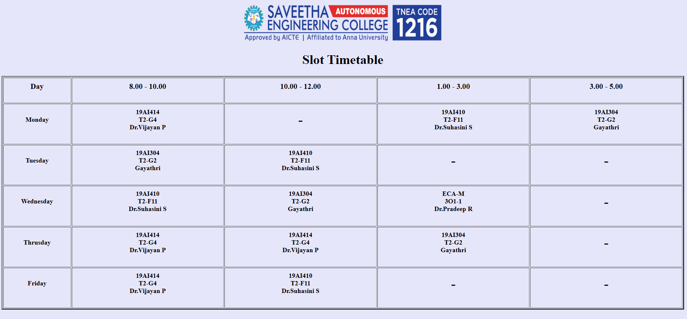
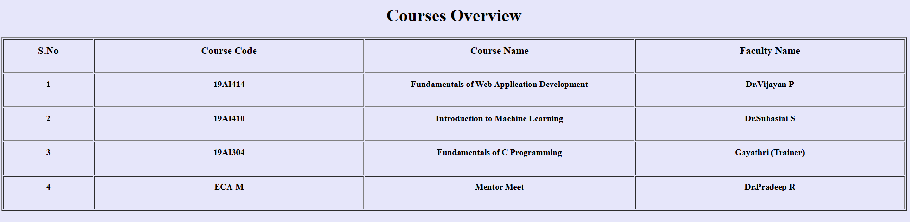

# Ex02 Time Table
## Date: 16-05-2026

## AIM
To write a html webpage page to display your slot timetable.

## ALGORITHM
### STEP 1
Create a Django-admin Interface.

### STEP 2
Create a static folder and inert HTML code.

### STEP 3
Create a simple table using ```<table>``` tag in html.

### STEP 4
Add header row using ```<th>``` tag.

### STEP 5
Add your timetable using ```<td>``` tag.

### STEP 6
Execute the program using runserver command.

## PROGRAM
```html
<html>
    <head>
        <title>
            Slot Timetable
        </title>
    </head>
    <body bgcolor="lavender">
        <center></center>
        <center><h1>Slot Timetable</h1></center>
        <table align="center" border="3" width="100%" cellpadding="10">
            <tr>
                <th width="10%"><h3>Day</h3></th>
                <th width="22.5%"><h3>8.00 - 10.00</h3></th>
                <th width="22.5%"><h3>10.00 - 12.00</h3></th>
                <th width="22.5%"><h3>1.00 - 3.00</h3></th>
                <th width="22.5%"><h3>3.00 - 5.00</h3></th>
            </tr>
            <tr>
                <td align="center"><h4>Monday</h4></td>
                <td align="center"><h4>19AI414<br>T2-G4<br>Dr.Vijayan P</h4></td>
                <td align="center"><h1>-</h1></td>
                <td align="center"><h4>19AI410<br>T2-F11<br>Dr.Suhasini S</h4></td>
                <td align="center"><h4>19AI304<br>T2-G2<br>Gayathri</h4></td>
            </tr>
            <tr>
                <td align="center"><h4>Tuesday</h4></td>
                <td align="center"><h4>19AI304<br>T2-G2<br>Gayathri</h4></td>
                <td align="center"><h4>19AI410<br>T2-F11<br>Dr.Suhasini</h4></td>
                <td align="center"><h1>-</h1></td>
                <td align="center"><h1>-</h1></td>
            </tr>
            <tr>
                <td align="center"><h4>Wednesday</h4></td>
                <td align="center"><h4>19AI410<br>T2-F11<br>Dr.Suhasini4</h4></td>
                <td align="center"><h4>19AI304<br>T2-G2<br>Gayathri</h4></td>
                <td align="center"><h4>ECA-M<br>3O1-1<br>Dr.Pradeep R</h4></td>
                <td align="center"><h1>-</h1></td>
            </tr>
            <tr>
                <td align="center"><h4>Thrusday</h4></td>
                <td align="center"><h4>19AI414<br>T2-G4<br>Dr.Vijayan P</h4></td>
                <td align="center"><h4>19AI414<br>T2-G4<br>Dr.Vijayan P</h4></td>
                <td align="center"><h4>19AI304<br>T2-G2<br>Gayathri</h4></td>
                <td align="center"><h1>-</h1></td>
            </tr>
            <tr>
                <td align="center"><h4>Friday</h4></td>
                <td align="center"><h4>19AI414<br>T2-G4<br>Dr.Vijayan P</h4></td>
                <td align="center"><h4>19AI410<br>T2-F11<br>Dr.Suhasini</h4></td>
                <td align="center"><h1>-</h1></td>
                <td align="center"><h1>-</h1></td>
            </tr>
        </table>
        <center><h1>Courses Overview</h1></center>
        <table align="center" border="3" width="100%" cellpadding="10">
            <tr>
                <th width="10%"><h3>S.No</h3></th>
                <th width="30%"><h3>Course Code</h3></th>
                <th width="30%"><h3>Course Name</h3></th>
                <th width="30%"><h3>Faculty Name</h3></th>
            </tr>
            <tr>
                <td align="center"><h4>1</h4></td>
                <td align="center"><h4>19AI414</h4></td>
                <td align="center"><h4>Fundamentals of Web Application Development</h4></td>
                <td align="center"><h4>Dr.Vijayan P</h4></td>
            </tr>
            <tr>
                <td align="center"><h4>2</h4></td>
                <td align="center"><h4>19AI410</h4></td>
                <td align="center"><h4>Introduction to Machine Learning</h4></td>
                <td align="center"><h4>Dr.Suhasini</h4></td>
            </tr>
            <tr>
                <td align="center"><h4>3</h4></td>
                <td align="center"><h4>19AI304</h4></td>
                <td align="center"><h4>Fundamentals of C Programming</h4></td>
                <td align="center"><h4>Gayathri (Trainer)</h4></td>
            </tr>
            <tr>
                <td align="center"><h4>4</h4></td>
                <td align="center"><h4>ECA-M</h4></td>
                <td align="center"><h4>Mentor Meet</h4></td>
                <td align="center"><h4>Dr.Pradeep R</h4></td>
            </tr>
        </table>
        <br>
        <br>
    </body>
</html>
```

## OUTPUT





## RESULT
The program for creating slot timetable using basic HTML tags is executed successfully.
